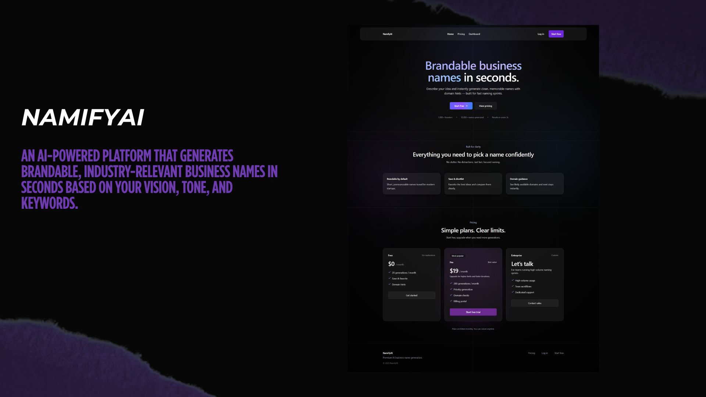

## NamifyAI

NamifyAI is a Next.js app for generating brandable business names, saving favorites, and managing usage/billing.



### Demo video

[Watch the demo (Google Drive)](https://drive.google.com/file/d/your-share-link-here/view?usp=sharing)

### Tech stack

- **Frontend**
  - Next.js (App Router)
  - React
  - Tailwind CSS
  - shadcn/ui-style components 
  - TanStack React Query (client data fetching)
  - Framer Motion (marketing animations)

- **Backend**
  - Next.js Route Handlers (`app/api/*`)
  - Prisma ORM
  - PostgreSQL

- **Auth**
  - NextAuth (Credentials + optional Google OAuth)

- **Email**
  - Resend (password reset emails)

- **AI**
  - OpenAI API

- **Billing**
  - Stripe (checkout, billing portal, webhook)

### Project structure

- `app/(marketing)`
  - Public marketing pages (home, pricing sections)
- `app/(auth)`
  - Auth pages (login, register, forgot/reset password)
- `app/dashboard`
  - Logged-in app (generate, history, billing)
- `app/api`
  - Server routes (AI generation, auth endpoints, names CRUD, usage, Stripe)
- `components`
  - Shared UI components (navbar, UI primitives)
- `lib`
  - Shared server/client utilities (auth, prisma, env, stripe, rate limiting)
- `prisma`
  - Prisma schema and migrations

### Key API routes

- **Auth**
  - `POST /api/auth/register`
  - `POST /api/auth/forgot-password` (sends reset email via Resend)
  - `POST /api/auth/reset-password`

- **AI + names**
  - `POST /api/ai/generate`
  - `GET /api/names`
  - `POST /api/names/save`
  - `POST /api/names/delete`
  - `POST /api/favorites` (favorites/save helpers)

- **Usage + billing**
  - `GET /api/usage`
  - `GET /api/usage/weekly`
  - `POST /api/stripe/checkout`
  - `POST /api/stripe/portal`
  - `POST /api/stripe/webhook`

### Database (Prisma)

See `prisma/schema.prisma` for the full source of truth. Core models used by the app include:

- `user`: accounts
- `account`: OAuth linkage (Google)
- `session`: session records (if enabled/used)
- `PasswordResetToken`: password reset tokens
- `GeneratedName`: generated/saved names history
- `UsageTracking`: monthly usage tracking
- `Subscription` and `StripeWebhookEvent`: billing state and webhook idempotency

## Local development

### 1) Install dependencies

```bash
npm install
```

### 2) Configure environment variables

Copy the example env file:

```bash
copy .env.example .env
```

Fill in required values (see `.env.example` for the full list).

### 3) Prisma

Run migrations and generate the Prisma client:

```bash
npm run prisma:generate
npm run prisma:migrate
```

### 4) Start the dev server

```bash
npm run dev
```

Open `http://localhost:3000`.

## Email (Resend) setup notes

Password reset emails are sent via Resend when `RESEND_API_KEY` is set.

- For local/dev, you can use:
  - `RESEND_FROM="NamifyAI <onboarding@resend.dev>"`
- For production, set `RESEND_FROM` to a sender on a **verified domain** in your Resend dashboard.
